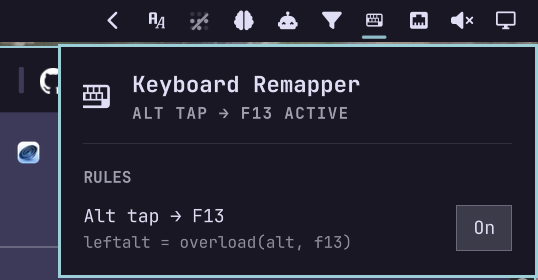

# omarchy-keyboard-remapper

An [Omarchy](https://omarchy.org/) shell plugin for `keyd` tap/hold
key-remap rules, toggled from a bar-icon popup. Ships with one example rule
(off by default): a standalone tap of the physical Alt key emits `F13`,
while holding Alt still passes through as a normal modifier for every
existing Hyprland/app Alt-chord.

## Why

tmux/screen/[herdr](https://herdr.dev)-style tools need a dedicated
*prefix* key, which is why they default to an unused chord like `ctrl+b`:
software can't tell "modifier held alone, then released" apart from
"modifier held as part of another shortcut." A key already used for other
shortcuts (like Alt) can't just be reassigned without losing it elsewhere.

`keyd`'s `overload(layer, key)` fixes this by making one physical key do
both jobs based on *how* it's pressed: a standalone tap emits an otherwise
unused key (e.g. `F13`, point herdr's `prefix` at it), while holding it
down still acts as the original modifier for every existing shortcut. This
happens below Hyprland's XKB layer, so it works regardless of any
XKB-level remaps (e.g. a Win↔Alt swap) already in place.



## Install

```sh
omarchy plugin add https://github.com/houz42/omarchy-keyboard-remapper.git --enable
```

The shipped example rule is **off by default** — open the bar icon's popup
and flip the switch to turn it on.

## Add your own mappings

Click **+ Add rule** in the popup. **Source key**, **Hold layer**, and
**Tap key** are searchable pickers — type to filter, e.g. typing "alt"
narrows straight to `leftalt`/`rightalt`. Source and tap are populated from
`keyd list-keys` (every key name keyd recognizes, bundled as
[`keyd-keys.json`](keyd-keys.json)); hold layer offers the five built-in
modifier layers keyd predefines (`alt`, `control`, `shift`, `meta`,
`altgr`) — custom `[layername]` sections aren't something this form
generates. Description is the only free-text field, and it's optional. The
label is always auto-generated from the source and tap you picked (e.g.
"leftalt tap → f13") — there's no separate field for it. Each rule shows a
**-** button to remove it the same way, no file editing needed either way.

Under the hood, every rule is one entry in [`rules.json`](rules.json), next
to `Panel.qml`, and hand-editing it directly works too — the popup form
just writes the same file:

```json
{
  "id": "alt-tap-f13",
  "label": "Alt tap → F13",
  "description": "For herdr / tmux-style app prefixes",
  "source": "leftalt",
  "holdLayer": "alt",
  "tap": "f13",
  "defaultEnabled": false
}
```

- `id` — unique, stable string. Used to remember this rule's on/off state
  across restarts, so don't change it once you've toggled the rule.
- `label` — shown in the popup. The form always derives this; hand-editing
  the file, you can set anything.
- `description` — optional; shown under the label in place of the raw
  syntax. The raw `source = overload(holdLayer, tap)` line is always
  available on hover, whether or not a description is set.
- `source` — the physical key to remap, in `keyd`'s naming (e.g. `leftalt`,
  `rightctrl`, `capslock`) — any name from
  [`keyd-keys.json`](keyd-keys.json), or run `keyd list-keys` yourself.
- `holdLayer` — what `source` acts as when held with another key. Stick to
  `alt`/`control`/`shift`/`meta`/`altgr` unless you're also hand-writing a
  custom `[layername]` section elsewhere in `/etc/keyd/` — this plugin's
  renderer only ever emits single `source = overload(holdLayer, tap)`
  lines, never layer section headers.
- `tap` — what a standalone tap of `source` alone emits.
- `defaultEnabled` — optional (default `false`) shipped on/off state for
  anyone installing fresh. Your own toggle choice, once made, always
  overrides this — editing `rules.json` later never resets a rule you've
  already turned on or off.

Editing `rules.json` by hand hot-reloads — no plugin reload needed, and the
popup picks up your changes immediately.

## Manual use

Toggle rules and see live status from the bar icon's popup — there's no
separate CLI. The two bundled scripts are used internally by the plugin:

```sh
bin/check-keyd-status <expected-conf-path> # read-only status/drift JSON, non-privileged
bin/apply-keyd-config <pending-conf-path>  # privileged (via pkexec): installs keyd if missing,
                                            # writes /etc/keyd/houz42-keyboard-remapper.conf, enables the service
```

## How it works

The popup renders all enabled rules from `rules.json` into one `keyd`
config text (`Panel.qml`'s `renderConf()`), keeps a copy of that text
non-privileged under `~/.local/state/omarchy/houz42.keyboard-remapper/`,
and on every status refresh compares the live `/etc/keyd/*.conf` against
that copy to detect drift — the read-only status script never needs to know
what a "rule" is, it just diffs two files.

Applying a change runs `bin/apply-keyd-config` through a single fixed-argv
`pkexec` call — never a `pkexec bash -c "..."`/`pkexec python3 -c "..."`
string, and never triggered automatically, only from an explicit button
press. That script installs `keyd` via `pacman` if it's missing, atomically
writes `/etc/keyd/houz42-keyboard-remapper.conf`, and enables/reloads the
`keyd` service.

## Known limitations

- The popup form can add and remove rules, but not edit an existing one in
  place — remove it and re-add it with the changed fields.
- `keyd` merges every `*.conf` file under `/etc/keyd/`. If you run another
  keyd-based remap tool alongside this plugin, make sure neither binds the
  same source key — conflicting lines across files produce ambiguous,
  load-order-dependent behavior.
- Uses Omarchy's internal shell components (`qs.Ui` / `qs.Commons`), which
  aren't a documented stable plugin API and could change without notice.

## Uninstall

Disabling or removing the plugin (`omarchy plugin disable houz42.keyboard-remapper`
/ `omarchy plugin remove houz42.keyboard-remapper`) does **not** touch
anything outside the plugin directory — it leaves `keyd` installed, its
service enabled, and `/etc/keyd/houz42-keyboard-remapper.conf` in place, so
any rules you'd enabled keep working even after the plugin itself is gone.
To fully remove it:

```sh
sudo rm /etc/keyd/houz42-keyboard-remapper.conf
sudo systemctl reload keyd || sudo systemctl restart keyd
# optionally, if nothing else on your system uses keyd:
sudo systemctl disable --now keyd
sudo pacman -R keyd
```

## License

MIT
